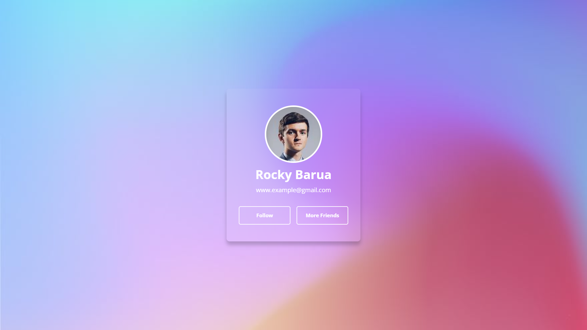

# Random User Generator || Glass Morphism

## Welcome! 👋

Hello! Thanks for cheking out this repository.

## What is it about

It's a random user generator made with vue.js and random user api. It has a glass-morphism ui.
The vue part is heavily inspired from treversy media.

Here's the video link-
https://youtu.be/qZXt1Aom3Cs

Here is the solution site url-
https://drougnov.github.io/random-user-generator-with-glass-morphism-master/

## Built with

-HTML

-CSS

-Javascript

-Vue.JS

-Random User API

## Author

Youtube - [DROUGNOV 182] https://www.youtube.com/channel/UC8iWkBPETy3ACQIQc5t8-kw

Facebook -[Biplob Barua Rocky] https://www.facebook.com/drougnov.bd.9

Frontend Mentor - https://www.frontendmentor.io/profile/Drougnov

### Any suggestion

I would be glad and greatful if you could leave any suggestion for this project or about anything else. Have a good day :)
